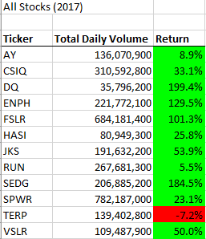
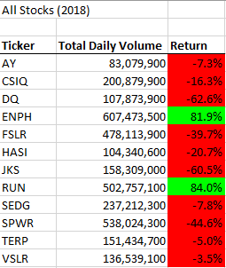
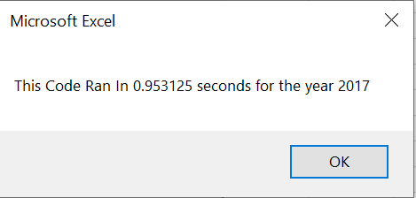
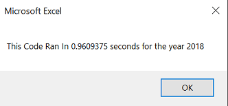
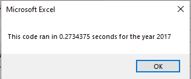

# Stock Analysis Using VBA
## Overview of Project
Steve is into finacial planning and asked us to create a spreadsheet capable to analysing a 12 stocks. However, he realized the potential of using spreadsheets for analysis and wanted the flexibility to analyze thousands of stocks simultaneously. Though the current spreadsheet works well for 12 stocks we needed to update our code to inculde multiple dates, volumes, start prices and end prices. This will help him research investments for his parents at a faster pace.

### Results

The results of the analysis were the same whether the code was refactored or not. The two most reliable stocks were ENPH and Run since they were positive both years while all other stocks tumbled below zero in 2018. What changed, however, was the speed at which the analysis code ran after it was refactored.

## Before Refactor

Before updating, the speed of the code was 0.95 and 0.96 seconds for 2017 and 2018 respectively. In this case, we used a nested for loop and only used the tickers to track all of the data in the spreadsheet. This made the process longer since the tickers were also used the code would loop though the entire sheet every time it needed to find the volumes, starting prices and ending prices.
## After Refactor

By using an index tracker and creating separate arrays for the volumes, start price and end price, we were able to shorten the run speed to 0.27 and 0.22 seconds for 2017 and 2018 respectively. Our array contained 12 stocks which started at 0 for AY and ended at 11 for VSLR. The ticker index was used to track when we were at the end of the data for a stock and update by 1 to move to another stock. Therefore, the code was able to sum the volumes while capturing the starting and ending prices for each stock without having to loop though the data many times.

## Advantages and Disadvantages of Refactoring
- 1 
- 2
- 3
 
## Advantages and Disadvantages of Original and Refactored Code
- 1
- 2
- 3

