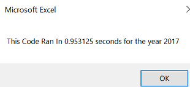
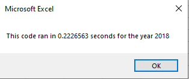

# Stock Analysis Using VBA
## Overview of Project
Steve is into finacial planning and asked us to create a spreadsheet capable to analysing a 12 stocks. However, he realized the potential of using spreadsheets for analysis and wanted the flexibility to analyze thousands of stocks simultaneously. Though the current spreadsheet works well for 12 stocks we needed to update our code to inculde multiple dates, volumes, start prices and end prices. This will help him research investments for his parents at a faster pace.

### Results

The results of the analysis were the same whether the code was refactored or not. The two most reliable stocks were ENPH and Run since they were positive both years while all other stocks tumbled below zero in 2018. What changed, however, was the speed at which the analysis code ran after it was refactored.

## Before Refactor

Before updating, the speed of the code was 
## After Refactor

Before updating our updates, the speed of the code

## Advantages and Disadvantages of Refactoring
- 1
- 2
- 3
 
## Advantages and Disadvantages of Original and Refactored Code
- 1
- 2
- 3

